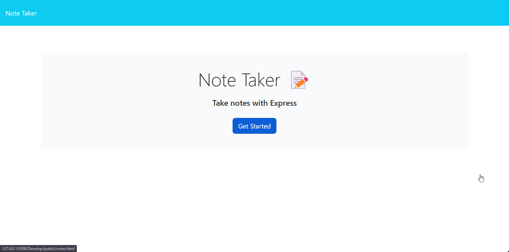

# Note Taker

## Description
        
A note taker that users can input a note title, and note content then being able to save the note to the page

 

## Table of Contents
- [Installation](#installation-installation)
- [Usage](#usage-usage)
- [License](#license-license)
- [Contributing](#contributing-contributing)
- [Questions](#questions-questions)
        
## Installation {#installation}
        
No installation needed just visit the URL
Here is Note Taker Url: [Deployed site here](https://makeitouthill.github.io/Task-Manager-11/)
## Usage {#usage}
        
To use this application you will want to click start button on the landing page, and then you are brought to the notes page where you can enter a title and contents for your notes or task, then using the save icon you are suppose to be able save note to the application.
        
## License {#license}
        
None
        
## Contributing {#contributing}
        
Avoid contributing
        
## Questions {#questions}
If you have any questions, please feel free to contact me at alex.horning.54@gmail.com 
or check out my GitHub profile at [Makeitouthill](https://github.com/Makeitouthill).